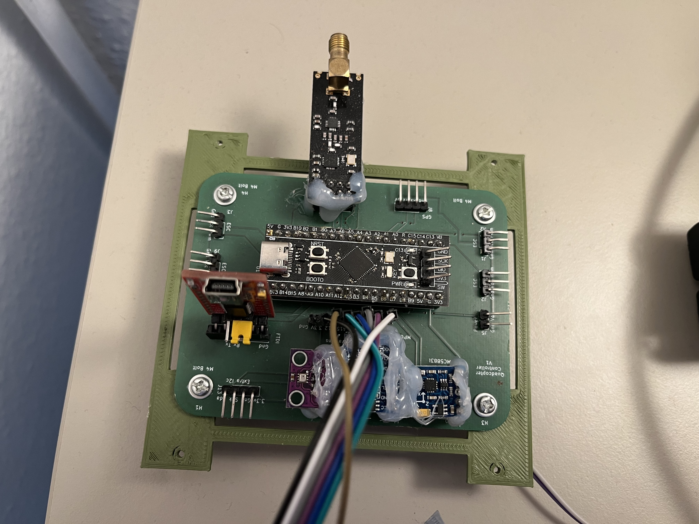
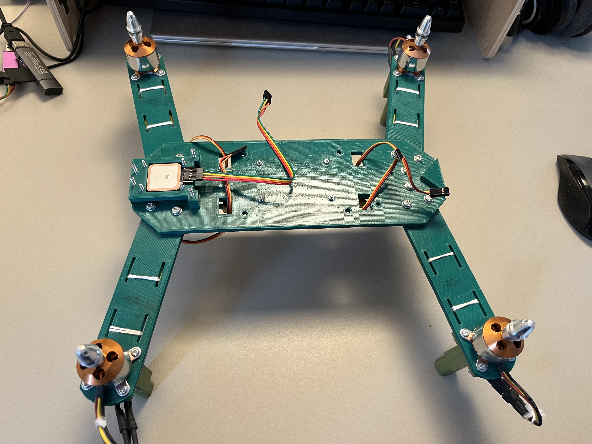
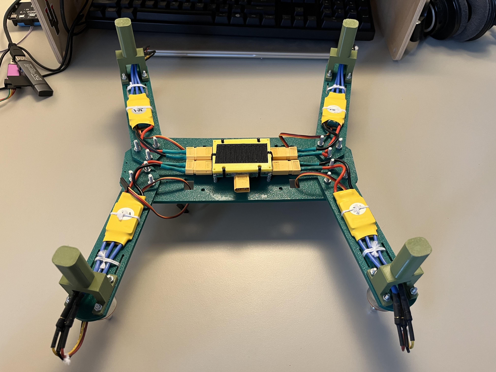
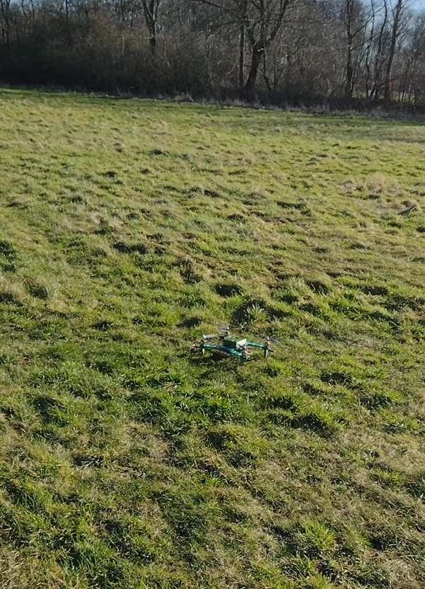

# STM32-Quadcopter

Work in progress. For in depth documentation use my self-balancing robot project which uses most of the same components, I am at the moment focusing on documenting the testing proccess of this robot. [<b>Link to self balancing robot</b>](https://github.com/Rokasbarasa1/ESP32-self-balancing-robot)

STM32F411, MPU6050, QMC5883l, BN357, BMP280, NRF24l01, Second STM32F411 SD Logger

[Link to SD logger repo](https://github.com/Rokas-embedded/Logger)

## How it looks like

### Controller:

### Frame top:

### Frame bottom:

## Video of test 3 with problems
YT link: https://www.youtube.com/shorts/ODtNJZJHQQQ

ESC name "Cheetah HW30A Brushless ESC"
BEC from ESC powers the flight controller

## TODO lists

TODO after test 1:
* X Take off testing equipment as drone is too heavy to fly.
* X Uncomment second axis stabilization

TODO after test 2:
* X fix stuttering issue with motors. I think it is from receiving too little radio signals
* X figure out how to make screw nuts not undo themselves. Make the whole thing more rigid.
* X maybe upgrade to the extended range radio sensor
* X Make the robot turn off if it gets to an angle of like 45 degrees as that is not helping it hover

TODO after test 3:
* X Fix issues with remote restarting and roll joystick not making contact with pins.
* X Fix quadcopter event loop lag. Improve refresh rate of robot
* ! figure out how to use integral without super windup
* X remove comments from both remote and quadcopter.
* X add loop timing to remote to have constant refresh rate
* X Implement logging to sd card and log in a format that can be understood by something like betaflight blackbox analyzer
* X Make sure the motors never stop spinning at even at the lowest setting when controlled by the remote. This will help responsiveness.

TODO after test 4:
* ! Add blackbox logging for gps data
* X Find out how to adjust what pwm frequency the esc accepts and change it from 50Hz to as fast as possible.
* X The radio module caches the data sent durring the boot proccess of the quadcopter. Make sure the data is deleted before it gets to the pid loop as it is dangerous.
* X Recalibrate accelerometer because it was moved and reglued.

TODO after test 5:
* X Tie down new escs like the old ones were
* X Make sure the motor screws don't undo from vibrations
* X Mark the front and back of the drone
* ! Fix issues with magnetometer
* X Fix blackbox log roll log being opposite
* X Reduce angle of attack for pitch and roll

TODO after test 7:
* ! Fix issues with blackbox logging showing wrong motors spinning and wrong pitch and rol. All of them either inverted or showing up on the wrong motor.
* ! Find a new more reliable magnetometer
* X Attach an FPV camera for better orientation and control while flying.

TODO after test 8 (Crashed and broke a rotor leg):
* X Print new rotor leg parts
* X Resolder cut ESC wires
* X Flip degrees per second yaw control application to motors and reduce the gain.

TODO after test 9:
* ! Continue doing small tests to see which way the robot is leaning with no pitch or roll inputs to calibrate the accelerometer
* X Add accelerometer calibration tweaking to the remote control so the drone does not have to be reflashed every time
* ! Consider switching to the kalman filter for better sensor data

Test 10
The new feature of the remote control being able to change the accelerometer offsets was really good. I managed to get a general direction in which it needed to be adjusted, it always leaned right and a bit forward. I was not able to adjust it perfectly though as i ran into issues of my pid settings just not being good enough, P and D are no longer enough to keep good balance. The new flight mode did not work as expected, i set it lower than what is generally expected from it and i did see that it was not enough, i needed to make a big demand of 70 cm for it to star rising a bit, which was not good. Need to have more confidence in it to not go flying somewhere, but possibly try it more after i figure out balance on the mode 0 balance. Low pass filtering of the gyro and accelerometer did not really have a negative impact on the quadcopter. Tried playing around more with the integral with a bit of success in lowering the oscillation of the drone when balancing. Need to continue tests on a very flat surface next as moderately level ground is not enough anymore. The beta in the 

TODO after test 10
* Do more tests in flight mode 0 with integral and when a better balance PID is found adjust accelerometer offsets again.
* Add a note in the remote control accelerometer calibration screens what the impact of the calibration will be, like - +X = Pitch forward and so on.
* Compare to other quadcopter projects to see what i am missing to make things better.

Test 11
Realized that offsetting the actual accelerometer calibrations might not be the best way to fix the quadcopter balance point. Tried implementing a degrees offset for the pitch and roll of accelerometer but ran into issues of feedback loops once the offset is applied, making one or more motors spin faster and faster when idle on the ground until they shut off. Meaning that the gyro_degrees is affected in a feedback loop. (The feedback loop turned out to be related to the mpu6050 outputs of acceleration and gyro freezing)

TODO after test 11
* Figure out problem with feedback loop of offset degrees
* Replace MPU6050 with new sensor as this one is getting frozen sometimes. It is fine to use for testing now, but for extended flights in the future it will fall from the sky.

Test 12
I did some more tests and i found out that there is a problem with using calibration and filtering. If calibration was done on data that was not filtered and then the actual data used is the filtered one, the effect is that the calibration is useless. I have to either apply filtering on the sensor hardware level or use filtering everywhere in software including when calibration is done. Durring testing i saw that the gyro values post calibration were a constant 3 degrees/s which made half of the flight test useless as the battery was half drained. 

I also found that that the motor and prop vibrations really do affect the sensor readings a lot, i am surprised it even hovers a bit after looking at them at 40% throttle.

TODO after test 12
* ! Add material dampening of vibration
* ! Improve software filtering to remove what vibration was not already removed by material dampening.
* ! Test vibrations with fresh propellers.

Test 13
Tested the new low pass filtering on the drone. It worked very good at the 45Hz frequency setting, not so good at 22Hz or 10Hz with significant delay in response being visible. Did more tests on the yaw control functionality, it works very well now but there is a big drop in throttle when yawing with at a fast rate. The altitude hold functionality in flight mode 1 works better now but is still no good as i still need to put the throttle stick to 75% for it to do anything and lift off it does not keep the altitude at a neutral position. The balance correction is now easier with the low-pass filter but it still needs some work to find the sweet spot.

TODO after test 13
* ! Find out if the yaw control throttle issue with altitude could be solved or if that is just because my quadcopter does not have enough power in to keep altitude with two motors.
* ! Improve the offsets more on the next test.
* ! Find out why the altitude is not working so good.

Test 14
Got a better balance point but when testing the altitude hold broke one of the legs.

Test 15
Dialed in the altitude hold settings for PID, the quadcopter now holds altitude relatively well, but as it struggles to find a level offset it is not good to improve it more at the moment. The offsets still change a lot even with a low pass filter on, need to invest more in flight-controller dampening.

Test 16
Mounted new motors and tested them. Much less vibration as can be seen in the vibration profile for them. The quadcopter flies a bit better, but not as much change as i though it would have. I tried my best to balance it so it does not drift and got closer than the other motors, but did not get results that are much better. I am no longer even sure that this is a goal worth doing more tests for, and maybe i should just get the best stabilization i can and move on to perfecting the altitude hold and gps hold.

I tested it again the same day. Managed to improve the altitude hold functionality, by raising the integral gain 12 times I sped up the time it takes for it to charge up, so it reacts faster from ground launch. An issue is that raising the integral gain to charge it faster makes the integral give some overshoot to the vertical velocity target, for this i raised the proportional by 0.2 and got it to control a bit. Further testing is needed.

I did notice that with the new prop and motor combo the quadcopter does not have as much battery, so it means it is less efficient. This is expected as the propellers are smaller. I have also found that the new propellers are more durable than the ones i had before, maybe the decreased tip speed, material and shape of the tips plays a role in that. The quadcopter feels more loose with the new propellers, and that is not necessarily a good thing.

TODO after test 16
* ! Tighten all the nuts on the legs
* ! Find out why when gps is enabled the flight controller starts having a 140ms delay in sensor readings in I2C after the thing being on for a couple of minutes. 

Test 17

I have hit a dead end in testing. The drone is not supposed to handle this bad, vibration has been eliminated. I believe i am missing something big in regards to PID. I have seen others implement acro mode first and then feed that to implement angle mode. I am going to try to do the same as i have planned to implement acro mode anyway.

Test 18

I was correct in thinking something was missing. As soon as i started testing with pid as angle mode -> acro mode -> motors things started to work great. The drone now balances a lot better in angle mode and is very easy to control compared to before. Acro mode works ok, i can see some wobble as it wants to settle down to to a angular rate, which means there is more tunning to do. The next step will be to get the sd card blackbox logger working again, by fixing the hardware problem it has. Using the logger I will be able to see how it responds to setpoints over many different pid values for the acro mode and in that way i can figure out which one fits it best.

TODO after test 18
* ! Fix the logger hardware problem.
* ! Add more details to the betaflight log about the settings of the quadcopter, so that it allows the data to be analyzed more.
* ! Make it so that when PID settings are changes, the quadcopter starts writing a new blackbox log file.
* ! If the quadcopter starts a new log file it has to add the ending to the old one, so that opening it is easier on the computer.
* ! Perform tests as in Chris Rossers's video on PID tunning.
* ! Fix broken legs.

Test checklist:
* Drone frame
* Controller
* Controller antenna
* Propellers
* Sd card adapter
* Micro sd card
* Pliers 
* Wire cutters
* Screwdriver 
* Screwdriver bits
* Remote control
* Laptop
* Usb extension cable
* STM32 programmer
* Charged battery
* Battery checker
