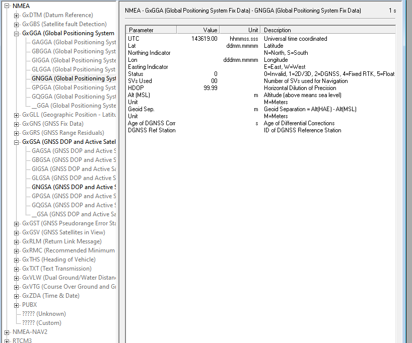

# Configuring with u-center V1
I have not implemented the configuration of the GPS in code as that is a bunch of UART commands and switching to one baud rate and then switching back... a pain in the ass.

Instead the configuration should be done once on the UBlox u-center V1 software.

## Steps:

1. Hook up the GPS module to a FTDI chip and connect it to your computer. Power it with 3.3V, it says it needs 5V but in all my tests the 5V modules can be powered perfectly fine with 3.3V

2. Open U-center

3. Connect to the GPS module in U-center on the correct COM port.

4. Wait for the GPS module to acquire some sattalites and get at least a 3D fix mode.

4. Disable all non needed data coming from the GPS. Only signals that are needed are GNGGA and GNGSA. If the data does not start with GN then you need to enable more satellite constellations.

To find what data is sent: 
View -> Messages View -> Non grayed out are the one

The black text data is what you are getting.

To disable or enable some of these: 
View -> Messages View -> UBX -> CFG - > MSG

Now disable all the ones you have but don't want, compare to what you have in the message view. I want GNGGA and GNGSA to be left on.

5. Save the disabled messages to GPS long term storage.

View -> Messages View -> UBX -> CFG - > CFG

Check all devices with CTRL+Left click and then click save

6. Change the baud rate 
View -> Messages View -> UBX -> CFG - > PRT

Set the baud rate to 115200

7. Reconnect to the GPS module with the different baud rate setting.

8. Save the new baud rate to long term storage.

9. Increase the frequency of data sent
View -> Messages View -> UBX -> CFG - > RATE

Set the measurement period to 100 ms which is effectively data at 10Hz

10. Save the new refresh rate to long term storage.